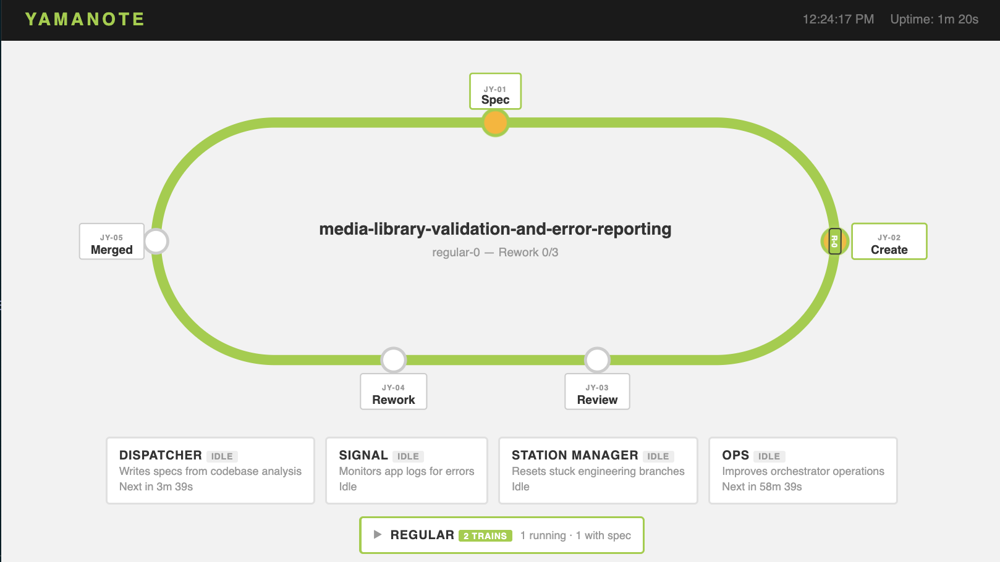
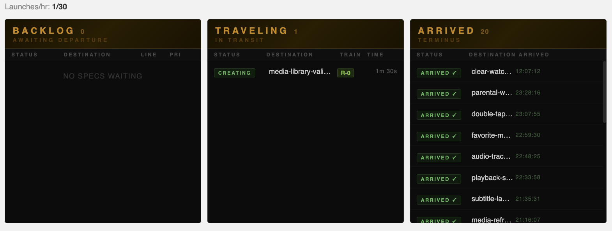

# Yamanote


A multi-agent orchestrator that coordinates Claude Code agent personas — **Dispatcher**, **Triage**, **Conductor**, **Inspector**, **Signal**, **Station Manager**, and **Operations** — to autonomously develop and maintain a software project. Agents communicate through a folder-based message bus and follow a structured spec-driven development pipeline.

Built to run unattended on a Raspberry Pi (or any Linux machine) as a systemd service.

## Architecture

The orchestrator runs a tick loop (every 10 seconds by default) that evaluates phases in order:

```
service_recovery → rework → dispatcher → triage → conductor → inspector → signal → entropy_check → station_manager_check
```

Each phase decides whether to launch its agent based on the current state of the pipeline. Only one instance of each agent runs at a time.

### Agents

| Agent | Model | Role |
|---|---|---|
| **Dispatcher** | Sonnet | Analyzes the codebase and app logs to write feature specs when the backlog is empty |
| **Triage** | Haiku | Gates each spec before Conductor runs — evaluates usefulness, priority, and readiness |
| **Conductor** | Sonnet | Implements specs on feature branches, one at a time |
| **Inspector** | Haiku¹ | Reviews diffs against `main`. Verifies spec acceptance criteria, approves or requests changes |
| **Signal** | Haiku | Monitors application logs for errors and files bug tickets into the backlog |
| **Station Manager** | Haiku | Resets branches when Conductor gets stuck in edit loops |
| **Operations** | Haiku | Analyzes orchestrator activity and implements small operational improvements |

¹ Inspector uses Sonnet on the `regular` (high-complexity) train. Defaults are tuned to fit a modest Agent SDK credit pool; override `SONNET_MODEL` / `HAIKU_MODEL` or the per-agent entries in `config.py` to change.

### Pipeline flow

```
Dispatcher creates spec
       ↓
Triage gate (BUILD / REJECT / HOLD)
       ↓
Conductor implements on feature branch
       ↓
Inspector reviews diff + verifies acceptance criteria
      ↙         ↘
  APPROVED   CHANGES_REQUESTED
     ↓              ↓
 Merge to main   Conductor rework (up to 3 attempts)
     ↓                ↓
Service restart    Re-review
```

REJECTED specs are logged to `agents/rejected_specs.txt`. HOLD specs move to `agents/drafts/` and are automatically recycled back to the backlog after 24 hours for re-evaluation.

### Directory structure

```
yamanote/
├── orchestrator.py       # Main orchestration loop
├── config.py             # All configuration and agent prompts
├── metrics.py            # Prometheus-compatible metrics registry (stdlib-only)
├── dashboard.py          # Optional web dashboard + /metrics endpoint
├── dashboard.html        # Dashboard UI (single-page, dark theme)
├── SETUP.md              # AI-agent-friendly setup instructions
├── agent-team.service    # systemd unit file
├── start.sh              # Wrapper that auto-restarts on exit
├── .env.example          # Template for environment variables
└── agents/               # Runtime data (gitignored)
    ├── backlog/          # JSON spec files (features and bugs)
    ├── drafts/           # HOLD specs awaiting re-evaluation
    ├── review/           # Inspector feedback files
    ├── logs/             # Stdout/stderr from each agent run
    └── activity.log      # Human-readable event log
```

## Getting started

> **Quick setup with an AI agent:** Open this repo in Claude Code (or any AI coding tool) and say "follow SETUP.md". It will detect your project, write the config, and set up the service for you.

### Prerequisites

- **Python 3.11+**
- **Claude Code CLI** — installed and authenticated (`claude` must be on your PATH). See [Claude Code docs](https://docs.anthropic.com/en/docs/claude-code) for setup.
- **Git** — the target project must be a git repository
- **Linux with systemd** (for running as a service; manual invocation works anywhere)

### 1. Clone the repository

```bash
git clone https://github.com/jeffcampbell/yamanote.git
cd yamanote
```

### 2. Configure your target project

Copy the example environment file and edit it:

```bash
cp .env.example .env
```

Set the environment variables for your project:

```bash
# Path to the parent directory containing your project(s)
AGENT_TEAM_DEV_DIR=~/Development

# Name of the default project directory to manage
AGENT_TEAM_DEFAULT_PROJECT=my-app

# Command to restart your app after a merge (leave empty to skip)
AGENT_TEAM_SERVICE_RESTART_CMD=sudo systemctl restart my-app.service
```

### 3. Run manually

Load the environment and start the orchestrator:

```bash
./start.sh
```

Or directly:

```bash
source .env && python3 orchestrator.py
```

The orchestrator creates `agents/backlog/`, `agents/review/`, `agents/drafts/`, and `agents/logs/` on first run. Press `Ctrl+C` to gracefully shut down all agents.

### 4. Run as a systemd service

Copy and adapt the included unit file:

```bash
sudo cp agent-team.service /etc/systemd/system/
sudo systemctl daemon-reload
sudo systemctl enable agent-team
sudo systemctl start agent-team
```

The unit file includes an `EnvironmentFile` directive that loads your `.env` automatically. Edit the `[Service]` section paths to match your setup:

- `WorkingDirectory` — path to the cloned repo
- `ExecStart` — path to `start.sh` in this repo
- `EnvironmentFile` — path to your `.env` file
- `User` — the user to run as

If your `AGENT_TEAM_SERVICE_RESTART_CMD` uses `sudo`, ensure the service user has passwordless sudo for that command:

```bash
# /etc/sudoers.d/yamanote
<your-user> ALL=(ALL) NOPASSWD: /usr/bin/systemctl restart your-app.service
```

### 5. Monitor

```bash
# Service status
systemctl status agent-team

# Live activity log
tail -f agents/activity.log

# Agent subprocess logs
ls -lt agents/logs/ | head
```

### 6. Web dashboard (optional)


*The pipeline view shows specs traveling around the Yamanote loop — from Spec through Create, Review, Rework, and finally Merged — with agent status cards and train counts below.*

A locally-hosted web dashboard gives an at-a-glance view of agent status, pipeline progress, backlog, and recent activity — accessible from any device on the LAN. Disabled by default.

**Enable via CLI flag:**
```bash
python3 orchestrator.py --dashboard              # port 8080
python3 orchestrator.py --dashboard-port 9090    # custom port
```

**Enable via environment variable** (recommended for systemd):
```bash
# Add to .env
AGENT_TEAM_DASHBOARD_PORT=8080
```

Then open `http://<host>:8080/` in a browser. The page auto-refreshes every 10 seconds.

The dashboard shows:
- **Agent cards** — status (running/idle/cooldown), PID, elapsed time, model
- **Pipeline** — current stage (Spec, Create, Review, Rework, Merged)
- **Stats** — launches per hour, sleep mode indicator
- **Backlog** — queued specs with priority
- **Activity feed** — color-coded event log
- **Configuration** — collapsible current settings


*The travel board tracks specs as they move through the pipeline — Backlog (awaiting departure), Traveling (in transit with a train), and Arrived (merged to trunk) — styled after a Japanese train station departure board.*

A JSON API is also available at `GET /api/status` for programmatic access.

#### Prometheus metrics

When the dashboard is enabled, a Prometheus-compatible `/metrics` endpoint is served at the same port:

```
GET http://<host>:<port>/metrics
```

Metrics exposed:

| Metric | Type | Description |
|---|---|---|
| `yamanote_specs_total` | Counter | Specs processed, labelled by outcome (`merged`, `rejected`, `conflict`, `entropy`, `sla_breach`) |
| `yamanote_agent_launches_total` | Counter | Agent subprocess launches, labelled by agent name |
| `yamanote_agent_failures_total` | Counter | Non-zero agent exits, labelled by agent name |
| `yamanote_log_errors_detected_total` | Counter | ERROR/WARNING lines detected by the log watcher |
| `yamanote_signal_triggers_total` | Counter | Times Signal was triggered reactively by the log watcher |
| `yamanote_backlog_size` | Gauge | Current number of specs in the backlog |
| `yamanote_trains_active` | Gauge | Number of trains currently assigned to a spec |
| `yamanote_launches_last_hour` | Gauge | Agent launches in the past 60 minutes |
| `yamanote_sleep_mode_active` | Gauge | `1` if rate-limit sleep mode is active |
| `yamanote_uptime_seconds` | Gauge | Seconds since the orchestrator started |
| `yamanote_budget_spend_usd` | Gauge | Estimated month-to-date Anthropic API spend |
| `yamanote_budget_limit_usd` | Gauge | Configured monthly USD cap (`0` if disabled) |
| `yamanote_budget_utilization` | Gauge | Spend / cap as a fraction |
| `yamanote_budget_exhausted` | Gauge | `1` when the budget gate is blocking new launches |

Point Prometheus at `http://<host>:<port>/metrics` and connect Grafana for dashboards.

## Customizing for your project

Yamanote is a general-purpose orchestrator. All project-specific context comes from configuration and files in your target project — the agent prompts are intentionally generic.

### Required

1. **Set `AGENT_TEAM_DEFAULT_PROJECT`** — the directory name of your project under `AGENT_TEAM_DEV_DIR`:
   ```bash
   AGENT_TEAM_DEFAULT_PROJECT=my-app
   ```

2. **Create a `CLAUDE.md`** in your project's root — this is the primary way agents understand your project. Include:
   - Build and test commands (`npm run build`, `./gradlew assembleDebug`, etc.)
   - Architecture overview (framework, language, key directories)
   - Coding conventions and style preferences
   - Any constraints agents should respect

### Optional

- **Create a `SPEC.md`** in your project with a feature roadmap or product spec. The Dispatcher reads this to generate more targeted feature specs.
- **Set Railway env vars** for Railway deployment:
  ```bash
  AGENT_TEAM_RAILWAY_PROJECT=my-railway-project
  AGENT_TEAM_RAILWAY_SERVICE=my-service-name
  ```
- **Set `AGENT_TEAM_SERVICE_RESTART_CMD`** for local service restarts after merges:
  ```bash
  AGENT_TEAM_SERVICE_RESTART_CMD="sudo systemctl restart my-app.service"
  ```
- **Set `AGENT_TEAM_APP_LOG_GLOB`** so Signal can monitor your application logs:
  ```bash
  AGENT_TEAM_APP_LOG_GLOB="logs/*.log"
  ```
- **Set `AGENT_TEAM_DASHBOARD_PORT`** to enable the web dashboard and `/metrics` endpoint:
  ```bash
  AGENT_TEAM_DASHBOARD_PORT=8080
  ```

## Adding work manually

Drop a JSON spec file into `agents/backlog/`:

```json
{
  "title": "short-kebab-title",
  "description": "What to build, acceptance criteria, and constraints.",
  "priority": "high",
  "created_by": "manual",
  "working_dir": "/path/to/your/project"
}
```

Conductor picks up the highest-priority spec first (`high` > `medium` > `low`), then oldest within the same priority. The Dispatcher also generates specs automatically when the backlog is empty.

## Configuration reference

All settings are in `config.py`. Key settings can be overridden via environment variables (see `.env.example`).

### Environment variables

| Variable | Default | Description |
|---|---|---|
| `AGENT_TEAM_DEV_DIR` | `~/Development` | Parent directory containing your project(s) |
| `AGENT_TEAM_DEFAULT_PROJECT` | *(none — required)* | Project directory name under `AGENT_TEAM_DEV_DIR` |
| `AGENT_TEAM_SERVICE_RESTART_CMD` | *(empty — skip restart)* | Shell command to restart your app after a merge |
| `AGENT_TEAM_DASHBOARD_PORT` | `0` *(disabled)* | Port for the web dashboard and `/metrics` endpoint (`0` = off) |
| `AGENT_TEAM_APP_LOG_GLOB` | *(auto-discover)* | Glob pattern for the project's log file (e.g. `logs/*.log`) |
| `AGENT_TEAM_RAILWAY_PROJECT` | *(empty)* | Railway project name for post-merge deploys |
| `AGENT_TEAM_RAILWAY_SERVICE` | *(empty)* | Railway service name |
| `AGENT_TEAM_RAILWAY_STAGING_ENV` | `staging` | Railway environment for staging deploys |
| `AGENT_TEAM_RAILWAY_PRODUCTION_ENV` | `production` | Railway environment for production deploys |
| `AGENT_TEAM_REGULAR_TRAINS` | `0` | Number of high-complexity parallel pipelines |
| `AGENT_TEAM_STANDARD_TRAINS` | `1` | Number of medium-complexity parallel pipelines |
| `AGENT_TEAM_EXPRESS_TRAINS` | `0` | Number of low-complexity parallel pipelines |
| `AGENT_TEAM_MONTHLY_BUDGET_USD` | `0` *(disabled)* | Monthly USD cap on estimated Anthropic spend. Pauses launches when reached. Resets at month boundary (UTC). |

### Timing

| Setting | Default | Description |
|---|---|---|
| `TICK_INTERVAL` | 10s | Seconds between orchestration ticks |
| `AGENT_TIMEOUT_SECONDS` | 1200s (20 min) | Max runtime per agent subprocess before termination |
| `SLEEP_MODE_DURATION` | 3600s (1 hr) | How long to sleep when fare limit triggers |

### SLA thresholds

| Setting | Default | Description |
|---|---|---|
| `SPEC_SLA_SECONDS` | 1800s (30 min) | Wall-clock limit for a spec across all phases |
| `CHECKPOINT_SLA_SECONDS` | 120s (2 min) | Max idle time at a pipeline checkpoint before intervention |
| `IDLE_SLA_SECONDS` | 14400s (4 hr) | All-idle time before the dispatcher is force-triggered |

### Guardrails

| Setting | Default | Description |
|---|---|---|
| `MAX_AGENT_LAUNCHES_PER_HOUR` | 30 | Triggers sleep mode when exceeded |
| `AGENT_ERROR_COOLDOWN` | 120s | Base cooldown after an agent exits non-zero |
| `MAX_ERROR_BACKOFF` | 3600s | Cap for exponential backoff on repeated failures |
| `ENTROPY_FIX_COMMIT_THRESHOLD` | 5 | "fix"/"update" commits on a branch before Conductor is fired and the branch is reset |
| `MAX_ENG_EDITS_BEFORE_RESET` | 5 | File edit cycles before Station Manager resets the branch |
| `MAX_REWORK_ATTEMPTS` | 3 | Inspector change requests before the spec is abandoned |
| `MAX_SPEC_TIMEOUTS` | 2 | Conductor timeouts on a spec before it is dropped |
| `MAX_CONFLICT_RETRIES` | 3 | Merge conflict retries before a spec is permanently rejected |
| `MAX_CONSECUTIVE_REJECTIONS` | 5 | Consecutive triage rejections before a project's dispatcher is paused |
| `STALL_PAUSE_SECONDS` | 86400s (24 hr) | How long to pause a stalled project's dispatcher |
| `DRAFTS_RECYCLE_AGE_SECONDS` | 86400s (24 hr) | Age before a HOLD spec is moved back to backlog |
| `WORKTREE_GC_INTERVAL` | 3600s (1 hr) | How often to scan for and remove orphaned git worktrees |
| `SELF_PROJECT_DIR` | `BASE_DIR` | Prevents agents from modifying the orchestrator itself |

### Git

| Setting | Default | Description |
|---|---|---|
| `TRUNK_BRANCH` | `main` | Branch that Conductor branches from and Inspector merges to |
| `GIT_TIMEOUT` | 30s | Timeout for git subprocesses |

## How the Dispatcher makes decisions

The Dispatcher receives several pieces of context before proposing a spec:

1. **App logs** — last 100 lines of the project's log file, for identifying errors and usage patterns
2. **Rejected specs** — the last 20 rejections over 30 days, to avoid re-proposing ideas that failed triage
3. **Work balance digest** — a summary of recent merged spec types (feature / bugfix / hardening / refactor) with a balance signal (e.g. `FEATURE-HEAVY`). The Dispatcher uses this as a soft signal — not a quota — to avoid overindexing on one type of work

Log files are discovered automatically:
1. `AGENT_TEAM_APP_LOG_GLOB` env var (if set)
2. `logs/*.log` in the project directory
3. `*.log` in the project root

When multiple files match, the most recently modified one is used.

## Extensible log sources

The log watcher supports pluggable backends via the `LogSource` ABC. Two are built in:

- **`FileLogSource`** — watches the project's local log file using byte offsets
- **`RailwayLogSource`** — streams logs from Railway deployments via the `railway` CLI

To add a custom backend (CloudWatch, k8s, Datadog, etc.):

```python
from orchestrator import LogSource

class MySource(LogSource):
    @property
    def name(self) -> str:
        return "my-source"

    def fetch_new_lines(self, project_dir: str) -> list[str]:
        # return new log lines since last call
        return []

station_manager.register_log_source(MySource())
```

## Safety features

- **Self-protection** — agents cannot create specs targeting the orchestrator's own codebase
- **Fare limit** — enters sleep mode for 1 hour after 30 launches in a rolling hour
- **Monthly token budget** — when `AGENT_TEAM_MONTHLY_BUDGET_USD` is set, the orchestrator estimates the cost of each launch from `TOKENS_PER_LAUNCH × MODEL_PRICES_USD` in `config.py`, tracks running spend in `agents/budget.json`, and skips new launches once the cap is reached. Resets at the start of each calendar month (UTC). The dashboard shows a fuel-gauge chip; estimates are coarse — tune `TOKENS_PER_LAUNCH` from your own usage over time
- **Error cooldown** — exponential backoff (120s base, 1hr cap) on agent failures
- **Entropy detection** — if a branch accumulates 5+ "fix"/"update" commits, the branch is deleted and the spec re-queued with a fresh start
- **Timeout enforcement** — agents are terminated after 20 minutes; timeouts trigger exponential cooldown and specs are dropped after 2 consecutive timeouts
- **Orphan recovery** — on startup, any `.in_progress` specs from a previous crash are restored to the backlog
- **Working directory validation** — specs must target a directory under `DEVELOPMENT_DIR`
- **Merge conflict detection** — before launching Inspector, the orchestrator performs a dry-run merge. If the branch conflicts with main, it is deleted and the spec re-queued (up to 3 attempts, then permanently rejected)
- **Service restart timeout** — service restart commands are killed after 5 minutes to prevent the orchestrator from hanging
- **Stall circuit breaker** — after 5 consecutive triage rejections with no successful merges, a project's dispatcher is paused for 24 hours to prevent infinite reject loops. Clears automatically when a spec merges
- **Drafts recycler** — HOLD specs older than 24 hours are automatically moved back to the backlog for re-evaluation by triage
- **Worktree GC** — orphaned `.worktrees/` directories (from crashes or config changes) are removed hourly to prevent git slowdown and disk accumulation
- **Spec rename race protection** — the atomic `.in_progress` rename is protected against filesystem errors; a failed claim resets the pipeline cleanly rather than corrupting state

## Manual controls

### Pause / resume

Touch the pause file to pause all agent launches. Remove it to resume:

```bash
touch agents/pause    # pause
rm agents/pause       # resume
```

### Skip a spec

Create a `.skip` file next to a backlog spec to exclude it from pickup:

```bash
touch agents/backlog/some_spec.json.skip    # skip
rm agents/backlog/some_spec.json.skip       # unskip
```

### Dashboard controls

When the dashboard is enabled, POST endpoints provide runtime control:

| Endpoint | Action |
|---|---|
| `POST /api/pause` | Pause the orchestrator |
| `POST /api/resume` | Resume the orchestrator |
| `POST /api/skip/<filename>` | Skip a backlog spec |
| `POST /api/unskip/<filename>` | Unskip a backlog spec |
| `POST /api/retry/<agent_name>` | Clear cooldown and retry an agent immediately |
| `GET /metrics` | Prometheus metrics (when dashboard is enabled) |

## License

MIT
